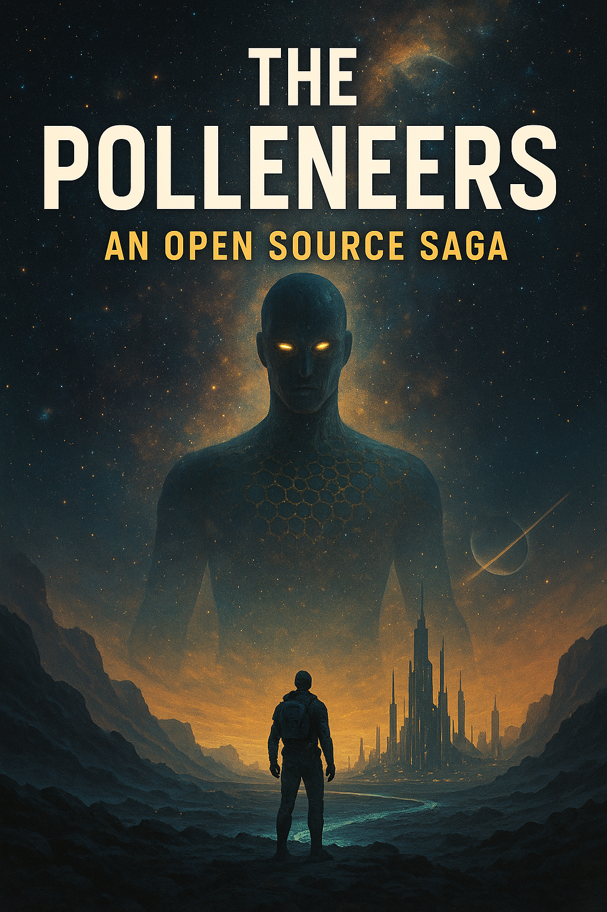

# The Polleneers: An Open Source Saga

Welcome to *The Polleneers*, a monumental science fiction saga spanning 100,000 years of human evolution, ethics, and consequence. This project is an experiment in collaborative storytelling, aiming to become one of the world's first truly open-source sci-fi novels.

## The Vision

Our vision is to create a rich, complex, and deeply human story, built not by a single author, but by a community of passionate writers, thinkers, and sci-fi lovers. We believe that by opening the narrative process, we can build a universe more detailed and a story more profound than any one person could create alone.

## How to Contribute

You are invited to read, critique, and contribute to the universe of *The Polleneers*. Whether you are a writer, an editor, a world-builder, or simply a fan with a great idea, your voice is welcome.

To get started, please familiarize yourself with the core of the story by reading the [main narrative outline](./outline.md). From there, you can explore the detailed era outlines and existing chapters.

Join our [Discord server](https://discord.gg/Ut6vA3RJ) to discuss the project with other contributors.

Contributions can include:
- Writing or editing chapters.
- Expanding on character backstories or world details.
- Proposing new plot points or story arcs.
- Identifying inconsistencies or areas for improvement.

## Intellectual Property and Licensing

This project operates under a Contributor License Agreement (CLA) to ensure its long-term legal stability and to allow for potential commercial publication.

By contributing to this project, you agree that your contributions will be licensed under the terms of the [Contributor License Agreement](./LICENSE) included in this repository. Please review the full text of the license before making any contributions.

In short, this agreement grants the project owner, Peter Szalontay, the necessary rights to manage, publish, and commercialize the work, while ensuring that the collaborative and open nature of its creation is respected.
